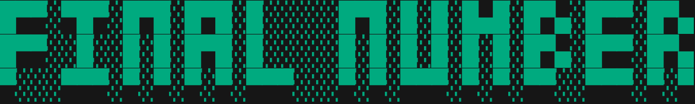

<p align="center">
  <a href="https://github.com/risfhm/Final-Number"></a>
</p>

<p align="center"><strong>Final Number</strong> <em>- An unfunny game</em></p>

<p align="center">
<a href="https://mit-license.org/">
    
</a>
<a href="">
    
</a>
<a href="">
    
</a>
</p>


**[Final Number](https://github.com/risfhm/Final-Number "Final Number")** is a game of choices based on luck and logic, 
the game has three main elements: Random Number, Final Number, 
and a Subtractor.

## Requirements

```shell
$ pip install -r requirements.txt
```

## Installation

```shell
$ git clone https://github.com/risfhm/Final-Number
$ cd Final-Number/src
$ python3 final-number.py
```

## Usage

The usability of this game plus its internal features and functionality are described in its **[documentation](https://github.com/risfhm/Final-Number/blob/main/docs/rules.md)**.
